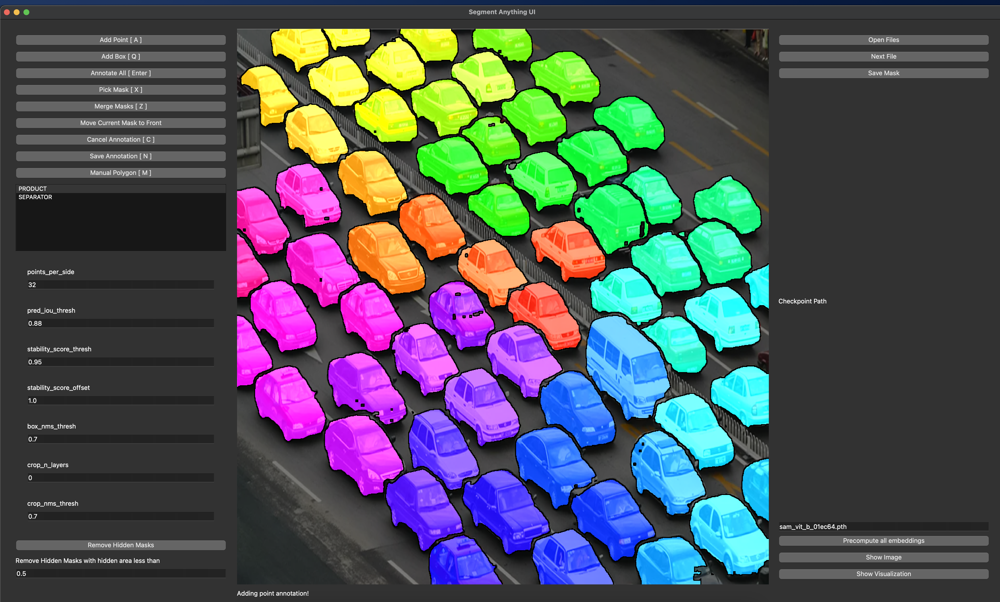

# Segment Anything UI
Simple UI for the model: [Segment anything](https://github.com/facebookresearch/segment-anything) from Facebook.


Segment anything UI for annotations



# Usage

 1. Install segment-anything python package from Github: [Segment anything](https://github.com/facebookresearch/segment-anything). Usually it is enough to run: ```pip install git+https://github.com/facebookresearch/segment-anything.git```.
 2. Download checkpoint [Checkpoint_Huge](https://dl.fbaipublicfiles.com/segment_anything/sam_vit_h_4b8939.pth) or [Checkpoint_Large](https://dl.fbaipublicfiles.com/segment_anything/sam_vit_l_0b3195.pth) or [Checkpoint_Base](https://dl.fbaipublicfiles.com/segment_anything/sam_vit_b_01ec64.pth) and put it into workspace folder.
 3. Fill default_path in ```segment_anything_ui/config.py```.
 4. Install efficientnet models ```pip install git+https://github.com/mit-han-lab/efficientvit```. See note below for Windows users about installing onnx!
 5. Install requirements.txt. ```pip install -r requirements.txt```.
 6. If on Ubuntu or Debian based distro, please use the following ```apt install libxkbcommon-x11-0 qt5dxcb-plugin libxcb-cursor0```. This will fix issues with Qt.
 7. ```export PYTHONPATH=$PYTHONPATH:.```.
 8. ```python segment_anything_ui/main_window.py```.

Currently, for saving a simple format is used: mask is saved as .png file, when masks are represented by values: 1 ... n and corresponding labels are saved as jsons. In json, labels are a map with mapping: MASK_ID: LABEL. MASK_ID is the id of the stored mask and LABEL is one of "labels.json" files.

``` 
For windows users, sometimes you will observe onnx used in EfficientVit is not easy to install using pip. In that case, it may be caused by
https://stackoverflow.com/questions/72352528/how-to-fix-winerror-206-the-filename-or-extension-is-too-long-error/76452218#76452218

To fix this error on your Windows machine on regedit and navigate to Computer\HKEY_LOCAL_MACHINE\SYSTEM\CurrentControlSet\Control\FileSystem and edit LongPathsEnabled and set value from 0 to 1
```

# Functions
There are multiple functions that this UI implements. Few of them are:

 * Add points - by left click of mouse button, you can add a positive point. By right click, you can add a negative point.
 * Add boxes - a bounding box can be added to SAM annotation when the proper annotation tool is selected. Manual points, boxes and polygons in the future are used for SAM prediction.
 * Add manual polygons - by clicking in the image using left mouse button (and selected manual annotation) manual annotation is done. It does not provide any other features right now.
 * Instance mask is saved by clicking on "Save Annotation" button.
 * Annotate All - uses SAM to predict all masks by prompting the model with a grid of points followed by post-processing to refine masks.
 * Pick Mask - Select a Mask from the image to delete it or inspect. Modifications are currently not allowed. As annotator allows multiple instances assigned to a pixel, Left clicking on the pixel cyclically changes between assigned masks.
 * Each Instance mask is assigned a class according to the chosen label in the list. This list is loaded from labels.json file.
 * Masks are inherently ordered based on the time of their creation, with earlier masks being dominant. Therefore masks that were annotated sooner are always present in the final mask, which is in form of an image with values 0 - N for N object instances. In the saved annotation, a pixel has only one value. A mask that is supposed to be used in the final annotation can be moved to the front by picking the desired mask and clicking on "Move Current Mask to Front" button. This is especially useful for "Annotate All" function.
 * As each pixel can have multiple masks assigned, a lot of masks may be hidden. In this case only a few pixel could afterwards be present in the final annotation (mostly on the border) and therefore "Remove Hidden Masks" button can be used. This button removes all masks with hidden pixels (they are added later than the dominant mask) with a visible IOU less threshold.
 * Masks annotations that have been "picked" can be deleted by Cancel current annotation button.
 * Cancel annotation - Cancel current annotation - all points, bounding boxes etc...
 * Partial mask - Some objects are hard to be automatically annotated - partial mask allows annotating a single instance by parts: each time a partial instance mask is annotated by clicking on the corresponding button the partial mask is enlarged and merged. Finally the final instance mask is given as a union of all partial masks.
 * Zoom - With zoom tool a user can zoom onto some part of the image, annotate it and then this annotation is propagated to the whole image.
 * Tags - Each image can have a tag assigned to it. This tag is saved in the annotation file and can be used for filtering images. Use comma separated values for multiple tags.
 * When holding MOUSE key, mask proposal is shown. This is useful for eliminating duplicite clicking.

# Buttons

Please Note that buttons are fully configurable. You can change bindings and add new buttons in **segment_anything_ui/config.py**.

| **Button** | **Description** | **Shortcut** |
| --- | --- | --- |
| Add Points | Mouse click will add positive (left) or negative (right) point. | W |
| Add Box | Mouse click will add a box. | Q |
| Annotate All | Runs regular grid annotation with parameters from the form | Enter |
| Pick Mask | Pick mask when clicking on it. Cycling through masks if pixel belongs to multiple masks. | X |
| Merge Masks | WIP: Merge masks when clicking on them. Cycling through masks if pixel belongs to multiple masks. | Z |
| Move Current Mask to Front | Use current mask as background (less important) | None |
| Cancel Annotation | Cancel current annotation | C |
| Save Annotation | Save current annotation | S |
| Manual Polygon | Draw polygon with mouse | R |
| Partial Mask | Allows to split a single object into multiple prompts. When pressed, partial mask is stored and summed with the following promped masks. | D |
| Remove Hidden Masks | Remove masks that have hidden pixels. | None |
| Zoom to Rectangle | Zoom in on the image. | E |
| ---- | ---- | ---- |
| Open Files | Load files from the folder | None |
| Next File | Load next image | F |
| Previous File | Load previous image | G |
| ---- | ---- | ---- |
| Precompute All Embeddings | Currently not implemented | None |
| Show Image | Currently not implemented | None |
| Show Visualization | Currently not implemented | None |


# TODO:

 - [x] - FIX: mouse picker for small objects is not precise.
 - [ ] - Region merging.
 - [x] - Manual annotation.
 - [x] - Saving and loading of masks.
 - [x] - Class support for assigning classes to objects.
 - [x] - Add object borders.
 - [x] - Fix mask size and QLabel size for precise mouse clicks.
 - [ ] - Draft mask when no points are visible.
 - [x] - Box zoom support.