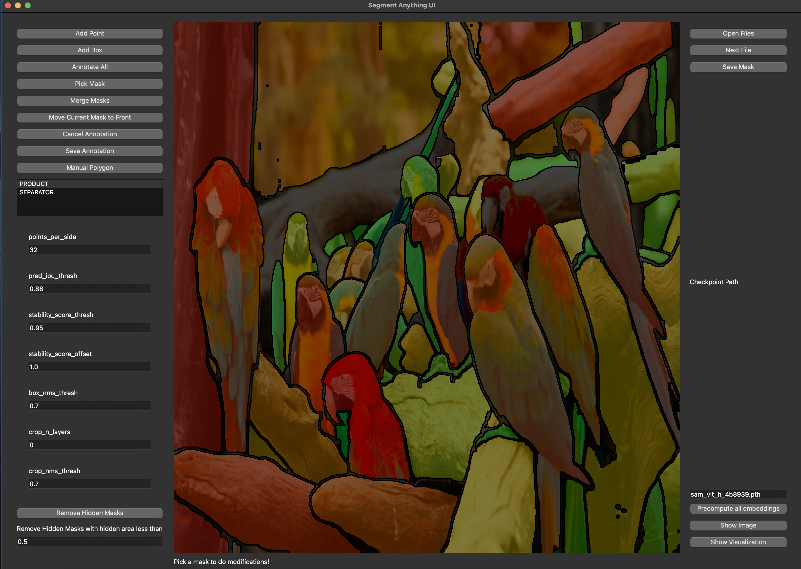

# segment-anything-ui
Segment anything UI for annotations



# Usage

 1. Install segment-anything python package from Github: [Segment anything](https://github.com/facebookresearch/segment-anything).
 2. Download checkpoint [Checkpoint](https://dl.fbaipublicfiles.com/segment_anything/sam_vit_h_4b8939.pth) and put it into workspace folder.
 3. Fill default_path in config.py.
 4. Install requirements.txt. ```pip install -r requirements.txt```.
 5. ```export PYTHONPATH=$PYTHONPATH:.```.
 6. ```python segment_anything_ui/main_window.py```.


# TODO:

 - [ ] - Region merging.
 - [ ] - Manual annotation + brush + deleting options.
 - [ ] - Shortcut description.
 - [ ] - Saving and loading of masks.
 - [ ] - Class support for assigning classes to objects.
 - [ ] - Add object borders.
